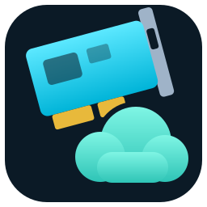

# Capture2Cloud

**Play your game console from a browser, a phone, or another Switch —
anywhere on your network.**

<br clear="left">

A USB capture card takes the HDMI out of a console; this streams it to
whatever you are holding, and sends your buttons back to the console
through a USB adapter that it sees as an ordinary controller. Nothing is
installed on the console and nothing is modified on it.

> **Status:** a working personal project, not a product. It runs daily on
> the setup it was built for. [WORKINPROGRESS.md](WORKINPROGRESS.md) has
> the honest state of things — what is measured, what is guessed, and
> what is still wrong.

---

## What you get

**A picture and a sound, with as little delay as the hardware allows.**
The card's frames are encoded once and shared by everyone watching, so a
second viewer costs bandwidth rather than a processor core.

**Something to play with, whatever you are holding.** A real controller
plugged into your phone or laptop, a touch pad drawn over the picture,
or the keyboard and mouse. All three end up as the same twenty-one bytes
by the time they reach the console.

**Watch, or play.** Anyone with the link can watch. Driving the console
needs the password, and that is checked on the host — not hidden in the
page, where hiding it would mean anyone who opens the developer tools is
a player.

**Four client types.** The browser, Android app, Nintendo Switch
homebrew and Wii U console homebrew can all use the same host. Watching
and playing still use the same host-side authentication.

**A server control panel on the machine itself**, opened from the tray.
It separates server/hardware controls from a dedicated **Clients** section,
where each remote client family has its own clearly labelled page. Console
input output is its own section too, with a pluggable backend selector for
Titan/ConsoleTuner today and the planned Joy-Con 2 BLE and JOCP/Pico paths.

**Waking the console**, optionally, by power-cycling a Home Assistant
smart plug — because cutting and restoring power is what wakes some
consoles from sleep.

---

## How it fits together

```
                          ┌── WebRTC ──────────────┐
   HDMI                   │   or WebSocket         ▼
    │                     │                     browser
    ▼                     │
 capture card ──► Capture2Cloud ──── TCP ───►  Android app
                          │                   Switch homebrew
                          ▲                        │
                          │      your buttons      │
                          └────────────────────────┘
                          │
                          ▼
                  USB adapter (Titan One)
                          │
                          ▼
                       console
```

The host-side controller path now ends in a pluggable output-backend
interface. Titan/ConsoleTuner is the first implementation; future
pcble2joycon2 and JOCP/Pico 2 W backends can consume the same merged
controller state without changing the browser or native-client protocols.

The console is driven by a real adapter pretending to be a controller,
which is why nothing has to change on the console. Which controller it
pretends to be — Switch Pro, Xbox pad, DualShock — is a setting; it is
written into the adapter's own memory, so it survives everything, and it
only takes effect once the adapter has been unplugged from the console
and back in. The settings window says so and waits for it.

---

## What you need

- **A USB HDMI capture card** that Linux sees as a webcam (UVC/V4L2).
  Developed against a MACROSILICON USB3 device.
- **A ConsoleTuner adapter** — Titan One, Cronus, CronusMAX — if you want
  to *play*. Without one everything still works as a view-only stream.
- **Linux with X11.** The local window uses SDL2, GTK3 and an
  X-specific hint.

---

## Getting started

```sh
git clone <this-repo> capture2cloud
cd capture2cloud
./scripts/install_deps.sh
$EDITOR scripts/.env
```

The script installs everything, adds a udev rule so the adapter works
without root, and copies `scripts/.env.example` to `scripts/.env`. On a
distribution it does not know, it prints the equivalent package list
instead of guessing.

Two things to set, and one you should:

```sh
v4l2-ctl --list-devices     # which /dev/video* is the card
pactl list short sources    # which source is its sound
```

```ini
VIDEO_DEVICE=/dev/video0
AUDIO_SOURCE=alsa_input.usb-MACROSILICON...
PLAYER_PASSWORD=something                # the one you should
```

**Set the password.** Without it, anyone who opens the page can drive
the console — and so can any website you happen to visit, through a
cross-origin request that reaches the "wake the console" button.

Then start it:

```sh
./toggle_capture2cloud.sh              # a window on this machine
./toggle_capture2cloud_headless.sh     # no window; the page is the interface
```

Both are toggles: run one again to stop it. Open
`http://<this-machine>:5080` from anything on the network.

---

## Playing

Click **start stream**, then **log in to play** and type the password.
Pick your input from the *gamepad* dropdown: a controller it detected,
**Virtual buttons (touch)**, or **Keyboard/mouse**.

**The touch pad** is a transparent overlay: two sticks, a d-pad with
real diagonals, face buttons, shoulders and triggers, in Xbox,
PlayStation or Nintendo lettering. A "move buttons" mode lets you drag
any control to where your thumbs actually are, and remembers it.

**Real controllers get their own remapping panel** — press a button,
bind it — kept per controller, because browsers describe the same pad
differently depending on the day and no single mapping fits them all.

**Keyboard and mouse** drive the same virtual pad, the mouse on the
right stick through pointer lock, with named binding profiles.

---

## Two ways the page can receive the stream

The page can take the video either way, and the choice is a setting in
its own menu — one or the other, for everybody, switchable while
running. `WEB_TRANSPORT` in the `.env` only decides which one the host
*starts* on.

**WebRTC** is the default and the faster of the two. Its media travels
peer-to-peer over UDP, so a lost packet costs one frame and nothing
waits for it.

**WebSocket** carries the same protocol the Android and Switch clients
speak, and the browser decodes it with WebCodecs. It is ordinary web
traffic, which is the whole point: Cloudflare, Nginx and Authelia relay
it without being told anything, where WebRTC's media never touches the
HTTP chain at all and needs STUN — possibly TURN — to leave the house.

The trade is TCP's, and it is real: a lost packet stalls everything
behind it instead of costing one frame. On a good link you will not
notice; on a lossy one you swap artefacts for pauses, which is the wrong
way round for something you are playing. Hence a choice, not a
replacement.

Each of these is its own encode, made only while somebody is watching
it. A path nobody is on costs nothing.

---

## Native clients

The native clients skip the browser and speak `c2s_protocol.h` directly.

**`switch_homebrew/`** — H.264 at 720p60, decoded on the console's video
engine, with controller and touch input.

**`android/`** — hardware H.264, Bluetooth/USB controllers, touch
controls and automatic bitrate.

**`wiiu_console/`** — homebrew running directly on a Wii U. The tested
path is 720p60 H.264 decoded by **H264DEC** and displayed from the NV12
decode buffers through a custom **GX2 zero-copy** renderer. Raw 48 kHz
stereo PCM arrives separately over UDP and is played directly through
**AX**.

The Wii U GamePad sends the same 21-slot controller state as the other
clients, mapped by physical button position. The menu supports host and
port configuration, password login through `nn::swkbd`, saved session
tokens, diagnostics, and **REMOTE HOME** for opening the captured
console's system menu.

The Wii U client uses **TCP 5083** for H.264/control and **UDP 5084** for
PCM audio. Authentication uses `/login` on `WEB_PORT` (5080 by default).
The password itself is never stored; only the temporary session token
may be saved to SD.

Its Latency tab saves two independent A/B switches: renderer VSync and an
asynchronous TCP receiver. The latter submits complete H.264 access units
to H264DEC while the UI thread is waiting for VBlank; the validated defaults
remain VSync on and frame-loop receive.

---

## Settings several people share

There is one capture card and one adapter, so some settings belong to
whoever is connected rather than to whoever changed them last. A client
that joins is **told** what everyone is watching and moves its own
controls to match, rather than pushing what it had saved and changing
the picture for people already there.

Volume, the picture adjustments, the touch pad and the stick shaping are
nobody else's business and are never sent anywhere.

[SHARED_SETTINGS.md](SHARED_SETTINGS.md) has the full split and why it
falls where it does.

---

## Configuration

Everything lives in `scripts/.env`, which is git-ignored and read by
both the program and the shell scripts.
[`scripts/.env.example`](scripts/.env.example) is the annotated list;
these are the ones worth knowing about.

| Key | What it does |
| --- | --- |
| `VIDEO_DEVICE`, `AUDIO_SOURCE` | Which card, and which of its sounds |
| `PLAYER_PASSWORD` | The password to play. Empty means anyone can. |
| `CAPTURE_FORMAT` | `yuyv` (raw, least processor) or `mjpeg` (least USB bandwidth). Also switchable from the page. |
| `WEB_TRANSPORT` | `webrtc` or `ws` — which one the page starts on |
| `WEB_PORT`, `WEB_AUTOSTART` | The page's port, and whether it starts on launch |
| `SWITCH_PORT`, `SWITCH_AUTOSTART` | The same, for the Android and Switch clients |
| `GAMEPAD_OUTPUT_BACKEND` | Console output backend. Currently `titan`; Joy-Con 2 BLE and JOCP/Pico are planned behind the same interface. |
| `TITAN_OUTPUT_PROTOCOL` | What the adapter pretends to be: `auto`, `switch`, `xb360`, `ps4`… |
| `LOCAL_SINK` | Play the sound on this output rather than the system default — worth setting where the default is a virtual device, since sound that vanishes into one looks exactly like sound this program failed to produce |
| `HA_URL`, `HA_TOKEN`, `HA_PLUG_ENTITY` | Home Assistant, for waking the console |

---

## Development

```sh
./tests/run_all.sh          # everything: C, JavaScript, the protocol, the attack suite
```

The launchers rebuild whenever a source is newer than the binary, so
there is usually nothing to compile by hand. `page.html` and the files
under `web/` are served straight from disk: edit, refresh, done.

The front end is eleven plain scripts sharing one scope, not modules,
and the order `page.html` loads them in is part of the program — a
declaration hoists within a file and not across two. A test compares
that order against the one the suite runs them in, because a file added
to one list and not the other passes here and breaks in a browser.

The architecture, the protocol, and the reasoning behind the parts that
look strange — latency, the GCAPI wire format, the threading — are in
[WORKINPROGRESS.md](WORKINPROGRESS.md) and in comments beside the code
they explain.

---

## Acknowledgements

The GCAPI protocol handling was reverse-engineered with help from
[GIMX](https://github.com/matlo/GIMX)'s source and USB captures of the
vendor's own software.

## Licence

Not yet chosen — treat as all rights reserved for now.
