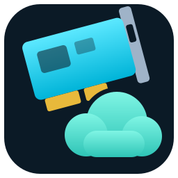

# Capture2Cloud

**Play a game console remotely from a browser, Android device, Nintendo Switch, Wii U or Nintendo 3DS.**

<br clear="left">

Capture2Cloud is an open-source, low-latency game streaming and remote play solution for Linux. It captures HDMI video and audio from a game console, streams it to one or more clients, and sends controller input back to the console.

Supported clients include web browsers, Android, Nintendo Switch, Wii U, Wii U GamePad and the original Nintendo 3DS / 2DS family.

It is a personal project built and tested on real hardware, not a commercial product.

---

## Features

* Low-latency video and audio streaming
* Multiple simultaneous clients
* Browser client with WebRTC or WebSocket/WebCodecs
* Native Android client
* Nintendo Switch homebrew client
* Native Old 3DS / Old 2DS client
* Native Wii U console client
* Direct Wii U GamePad streaming
* Physical, virtual, keyboard/mouse and local controller input
* Server-side merging of all controller sources
* Pluggable controller-output backends
* Live controller input/output shaping
* Password-protected control access
* Remote console wake with automatic controller reconnection

Development notes and known limitations are kept in [WORKINPROGRESS.md](docs/WORKINPROGRESS.md).

---

## Architecture

```text
Console HDMI
    │
    ▼
USB capture card
    │
    ▼
Capture2Cloud
    │
    ├── Browser
    ├── Android
    ├── Nintendo Switch
    ├── Old 3DS / Old 2DS
    ├── Wii U Console
    └── Wii U GamePad

Client/local controller input
    │
    ▼
Gamepad bridge
    │
    ├── Titan / ConsoleTuner USB
    └── pcble2gamepad Bluetooth
```

Clients do not need to know which controller or wake backend is active. They only send generic actions such as `WAKE` or `RESET_DONGLE`; the host handles the implementation.

---

## Requirements

* Linux host
* V4L2/UVC-compatible HDMI capture card
* PulseAudio-compatible audio source
* HDMI console
* Browser or supported native client

A controller-output backend is optional. Without one, Capture2Cloud can still be used as a view-only streaming server.

---

## Installation

```sh
git clone https://github.com/wozt/capture2cloud
cd capture2cloud

./scripts/install_deps.sh
cp scripts/.env.example scripts/.env
$EDITOR scripts/.env
```

Find capture devices with:

```sh
v4l2-ctl --list-devices
pactl list short sources
```

Minimal configuration:

```ini
VIDEO_DEVICE=/dev/v4l/by-id/...
AUDIO_SOURCE=alsa_input...
PLAYER_PASSWORD=change-me
```

Start Capture2Cloud:

```sh
./toggle_capture2cloud.sh
```

Headless:

```sh
./toggle_capture2cloud_headless.sh
```

The default browser interface is available at:

```text
http://<host>:5080
```

Run the launcher again to stop the server.

---

## Controller output

Capture2Cloud currently supports two output backends.

### Titan / ConsoleTuner

USB adapters such as Titan One and compatible ConsoleTuner devices.

```ini
GAMEPAD_OUTPUT_BACKEND=titan
TITAN_OUTPUT_PROTOCOL=switch
```

### pcble2gamepad

The Linux host can emulate a Nintendo controller directly over Bluetooth.

```ini
GAMEPAD_OUTPUT_BACKEND=pcble
PCBLE_CONTROLLER=pro
```

Install the privileged Bluetooth helper once:

```sh
sudo ./scripts/install_pcble_backend.sh
```

The main Capture2Cloud process remains unprivileged. Bluetooth ownership and raw HCI operations are isolated in the helper.

The GTK **Controller output** page provides adapter discovery, pairing, reconnect, status and controller configuration.

Bluetooth adapters are remembered by their physical MAC address rather than `hci0`, `hci1`, etc.

The same recovery path is used by:

* startup reconnect
* GTK reconnect
* Maintenance
* browser `RESET_DONGLE`
* native-client `RESET_DONGLE`

---

## Console wake

Capture2Cloud has a server-side reset/wake abstraction.

Every client simply requests:

```text
WAKE
```

The host decides how the console is actually woken and also handles controller recovery.

### Script

The traditional method runs a configurable script:

```ini
RESET_METHOD=script
RESET_SCRIPT=scripts/wake_console.sh
```

The bundled script can power-cycle a console through Home Assistant.

After the wake action, Capture2Cloud watches the capture image and reconnects the controller output when the console starts producing video again.

### Switch 2 Bluetooth wake

Capture2Cloud can also wake a sleeping Nintendo Switch 2 using its Bluetooth wake advertisement:

```ini
RESET_METHOD=bluetooth
RESET_BT_CONSOLE=switch2
RESET_BT_ADAPTER=
```

Setup is done from the GTK **Reset method** page:

1. select the Bluetooth adapter
2. test HCI compatibility
3. put the Switch 2 to sleep
4. capture a real wake advertisement from a paired controller
5. test the saved beacon

The captured beacon is stored locally at:

```text
~/.local/share/capture2cloud/reset/switch2-beacon.bin
```

with user-only permissions.

During a real wake:

```text
release pcble if necessary
        ↓
transmit saved Switch 2 wake beacon
        ↓
wait 1 second
        ↓
recover/reconnect controller output
```

The same operation is used by GTK Overview, GTK Maintenance, the browser and native clients.

---

## Controller input

Controller input can come from:

* browser gamepads
* virtual touch controls
* keyboard and mouse
* Android
* Nintendo Switch
* Old 3DS / Old 2DS
* Wii U
* a controller connected directly to the Linux host

All sources are merged on the server before being sent to the selected output backend.

Input and final output shaping can be configured from GTK.

---

## Clients

### Browser

Built-in web client supporting:

* WebRTC
* WebSocket/WebCodecs
* gamepads
* virtual controls
* keyboard/mouse
* authentication

No native application is required on the client device.

### Android

Located in:

```text
android/
```

Native H.264 client with hardware decoding, touch controls and physical controller support.

### Nintendo Switch

Located in:

```text
switch_homebrew/
```

Native H.264 homebrew client with controller and touch input.

### Nintendo 3DS / 2DS

Located in:

```text
3ds/
```

Native client designed for the original Nintendo 3DS, Nintendo 3DS XL and Nintendo 2DS.

It does not require New Nintendo 3DS CPU features.

The server provides a dedicated 400×240 at 30 FPS stream optimized for the limited CPU and Wi-Fi hardware of the original 3DS family.

Available video modes include:

* MPEG-1 Video
* MPEG-2 Video
* MPEG-4 Part 2
* JPEG

The client includes physical controller input, touchscreen virtual controls, a virtual right stick, missing Switch-style buttons, authentication, runtime codec selection, aspect-ratio controls and performance statistics.

Video decoding and rendering are specifically optimized for Old 3DS hardware, including use of the 3DS Y2R hardware for colour conversion where applicable.

See [3ds/README.md](3ds/README.md).

### Wii U Console

Located in:

```text
wiiu_console/
```

Native Wii U client using H264DEC hardware decoding and GX2 NV12 rendering, with GamePad input and remote controls.

See [wiiu_console/README.md](wiiu_console/README.md).

### Wii U GamePad

Located in:

```text
wiiu_gamepad/
```

Streams directly to a real Wii U GamePad through the libdrc-based path, with input returned to the common controller bridge.

---

## Configuration

Main configuration:

```text
scripts/.env
```

Annotated template:

```text
scripts/.env.example
```

Important options include:

| Setting | Purpose |
| --- | --- |
| `VIDEO_DEVICE` | V4L2 capture device |
| `AUDIO_SOURCE` | Audio capture source |
| `PLAYER_PASSWORD` | Controller-access password |
| `CAPTURE_FORMAT` | `yuyv` or `mjpeg` |
| `WEB_PORT` | Browser server port |
| `SWITCH_PORT` | Switch / Android native-client port |
| `WIIU_CONSOLE_PORT` | Wii U console client port |
| `OLD3DS_PORT` | Old 3DS / Old 2DS client port |
| `GAMEPAD_OUTPUT_BACKEND` | `titan` or `pcble` |
| `PCBLE_CONTROLLER` | Nintendo controller profile |
| `RESET_METHOD` | `script` or `bluetooth` |
| `RESET_SCRIPT` | Script wake command |
| `RESET_BT_ADAPTER` | Bluetooth wake adapter MAC |

Most runtime configuration can also be changed from the GTK interface.

---

## Development

Run the test suite with:

```sh
./tests/run_all.sh
```

Builds are normally handled automatically by the launch scripts.

Useful project documentation:

* [WORKINPROGRESS.md](docs/WORKINPROGRESS.md) — development notes and measurements
* [SHARED_SETTINGS.md](docs/SHARED_SETTINGS.md) — host/client setting ownership
* [3ds/README.md](3ds/README.md) — Old 3DS / Old 2DS client
* [wiiu_console/README.md](wiiu_console/README.md) — Wii U console client

---

## Acknowledgements

GCAPI support was developed with help from the source code of [GIMX](https://github.com/matlo/GIMX) and USB captures of ConsoleTuner software.

The Bluetooth controller backend includes work developed as **pcble2gamepad** and the upstream projects credited by its vendored source and licence files.

---

## Licence

Capture2Cloud is licensed under the GNU General Public License v3.0.

See [LICENSE](LICENSE) for details.